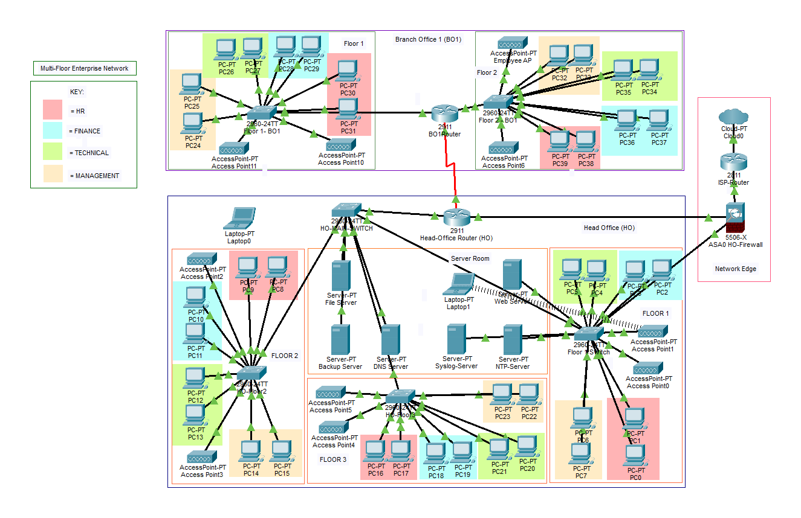

# Multi-Floor Enterprise Network

A Cisco Packet Tracer enterprise-network project that demonstrates routing, switching, wireless connectivity, centralized services, and layered network security across a multi-floor Head Office and branch environment.



## Project Overview

The network uses a hierarchical design in which the Head Office acts as the central site and connects to a branch office through WAN links. Departmental traffic is separated with VLANs for HR, Finance, Technical, and Management, while dedicated wireless, server, management, and DMZ networks improve organization and security.

The design includes dynamic routing, internet connectivity, secure remote-site communication, centralized servers, and access-control mechanisms. The complete implementation is available in the Packet Tracer file, while the detailed configuration evidence and testing results are provided in the project report.

## Main Features

### Routing and Switching

- VLAN-based departmental segmentation
- Inter-VLAN routing
- OSPF as the primary dynamic routing protocol
- EIGRP as a backup routing protocol
- RIP v2 for legacy-routing support
- NAT for private-to-public address translation
- Rapid PVST+ for loop prevention and faster convergence
- Root and secondary-root bridge configuration
- Port security on switch access ports
- DHCP-based address assignment

### Network Security

- Cisco ASA 5506-X firewall at the network edge
- Separate inside, outside, and DMZ security zones
- GRE tunnel with IPsec protection for secure WAN communication
- Access Control Lists for traffic filtering
- Guest Wi-Fi isolation from internal resources
- Restricted management access through SSH
- DHCP Snooping and Dynamic ARP Inspection
- WPA2-Personal wireless security

### Centralized Services

- DNS server for hostname resolution
- NTP server for time synchronization
- Syslog server for centralized event logging
- File server with FTP and HTTP services
- Backup server using TFTP and FTP
- Web server hosted in the DMZ

## Network Design

The topology contains:

- A three-floor Head Office
- A two-floor branch office
- Departmental networks for HR, Finance, Technical, and Management
- Employee and guest wireless networks
- Core and floor-level switches
- Head Office and branch routers
- An ASA firewall and ISP edge
- Centralized DNS, NTP, Syslog, file, backup, and web servers

## Addressing Summary

| Purpose | Network |
|---|---|
| Head Office internal networks | `10.1.x.0/24` |
| Branch Office internal networks | `10.2.x.0/24` |
| Server and management network | `10.1.80.0/24` |
| DMZ web-server network | `10.1.99.0/24` |
| Head Office to Branch WAN | `192.168.1.0/30` |
| GRE tunnel network | `10.100.0.0/30` |
| Public network edge | `200.1.1.0/30` |


## Repository Structure

```text
multi-floor-enterprise-network/
├── Multi-Floor-Enterprise-Network.pkt
├── README.md
├── .gitignore
├── .gitattributes
└── assets/
    └── network-topology.png
```

## How to Run the Project

1. Install Cisco Packet Tracer.
2. Download or clone this repository.
3. Open `Multi-Floor-Enterprise-Network.pkt` in Packet Tracer.
4. Allow the topology to load completely.
5. Inspect router, switch, firewall, wireless, and server configurations.
6. Use Realtime or Simulation Mode to test packet flow and network behavior.

## Suggested Verification Commands

```text
show ip interface brief
show ip route
show ip protocols
show vlan brief
show interfaces trunk
show spanning-tree
show port-security
show access-lists
show ip nat translations
show ip ssh
show interface tunnel0
ping <destination-ip>
traceroute <destination-ip>
```

Command support depends on the selected Packet Tracer device.

## Testing Covered

The project documentation includes evidence for:

- Inter-VLAN and inter-site connectivity
- Dynamic-routing operation
- NAT translation
- GRE-tunnel availability
- Firewall interface status
- ACL-based traffic restrictions
- SSH availability
- DNS and server reachability
- Wireless connectivity
- Centralized network services

## Design Evaluation

The network provides a scalable and structured enterprise design with centralized management, traffic segmentation, secured WAN communication, and layered access control. Potential future improvements include firewall redundancy and Quality of Service implementation.

## Project Team

- Habiba Arif
- Momina Aamir 
- Muhammad Awais Hashmi 
- Muhammad Bilawal

## Academic Context

This project was completed for the Routing & Switching Lab as an educational Cisco Packet Tracer implementation.

## Security Note

Any usernames, passwords, wireless keys, or shared secrets visible in the simulation or report are lab-only credentials. They must not be reused in real systems.
